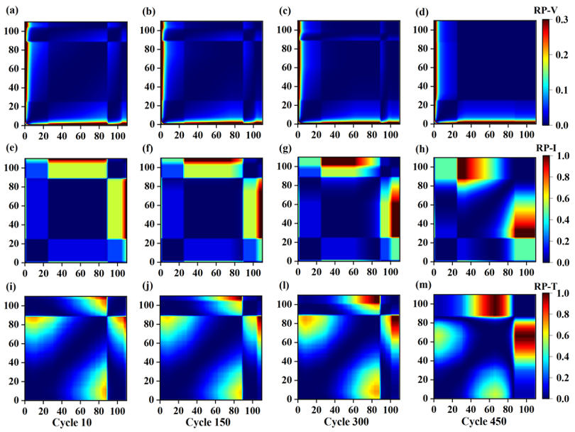
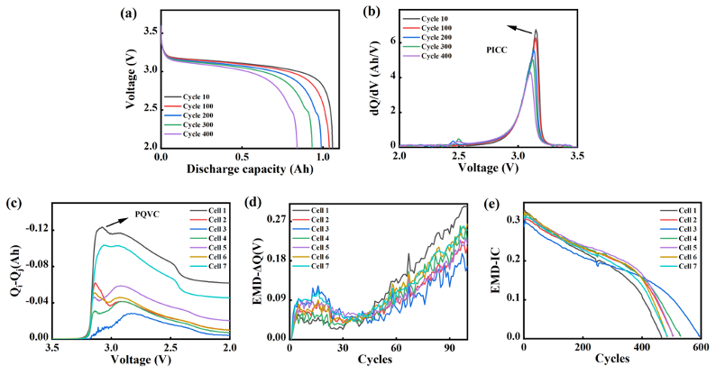
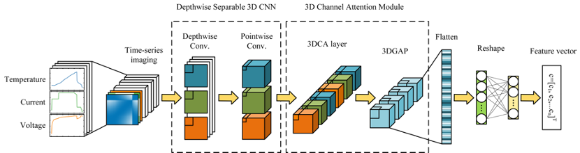
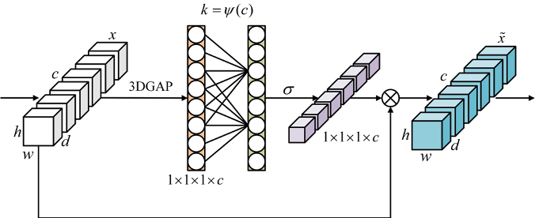
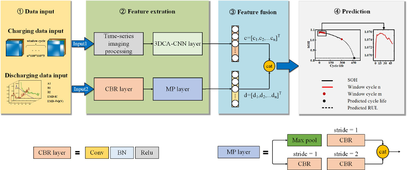
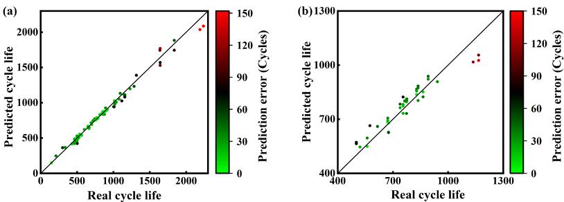
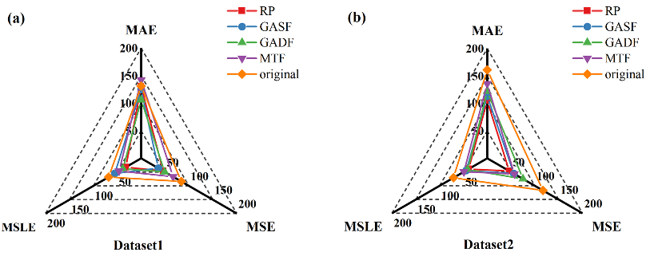
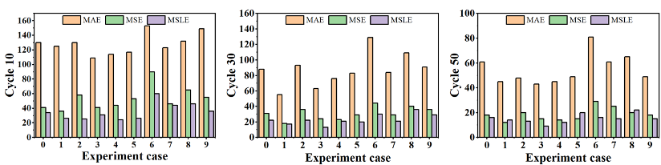
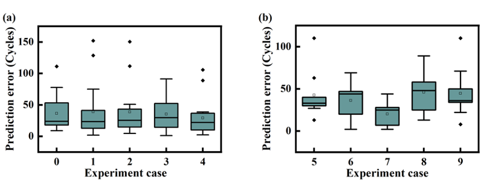

# Lithium-ion Battery Cycle LIfe Prediction

## Life prediction model for lithium-ion battery via a 3D convolutional network enhanced by channel attention considering charging and discharging process


While lithium batteries provide high efficiency and low cost, accurately predicting the cycle life of batteries under different charging protocols remains a challenge. The usage of batteries with inadequate cycle life can potentially introduce safety hazards. In this study, a Depthwise Separable 3D Convolutional Network Model Fusing Channel Attention (DS-3DCA-CNN) model considering charging and discharging process is proposed for life prediction of lithium batteries. Firstly, the recurrence plot is used to transform varied cycle charging data into multidimensional form, simultaneously extracting relevant features from discharging data and analyzing their correlation with battery cycle life. Secondly, the Depthwise Separable 3D convolution is used for quicker model training with fewer parameter calculations, and introduce a 3D Channel Attention (3DCA) module to increase channel interactions while keeping model complexity low. Finally, ablation experiments are conducted to explore the influence of different time series imaging methods on the accuracy of model prediction results. Experimental results reveal that the proposed DS-3DCA-CNN model, using only 10 initial cycles, predicts battery cycle life with an average error of 35 cycles and achieves a 16-cycle average error when predicting remaining useful life with 20 window cycles of data.


### Input data generation and feature analysis

The degradation process of batteries involves intricate thermoelectric coupling, making it challenging to directly measure the battery life situation. Instead, a common approach is to assess the cycle life and RUL by analyzing the voltage, current, and temperature curves obtained during charging and discharging cycles. In contrast to conventional feature-based methods, this section introduces a approach that generates input data from the charging and discharging processes separately. By combining the strengths of machine learning, this method automatically extracts features while also allowing for manual feature selection. This comprehensive approach aims to provide a more detailed description of battery degradation between different cycles.

### Recurrence Plots-VIT heatmaps in different cycles


(a)-(d) the voltage RP heatmap in 10, 150, 300 and 450 charging cycles; (e)-(h) the current RP heatmap in 10, 150, 300 and 450 charging cycles; (i)-(m) the temperature RP heatmap in 10, 150, 300 and 450 charging cycles.

### Feature extraction based on discharging process


(a) Q-V curves of the battery under different cycles; (b) incremental capacity curves of the battery under different cycles; (c)  curves of 7 cells based on discharging process; (d) EMD-ΔQ(V) curves of 7 cells for the first 100 cycles; (e) EMD-IC curves of 7 cells based on the whole cycle life.

### Depthwise Separable 3D Convolutional Network Model Fusing Channel Attention (DS-3DCA-CNN)
The method to predict cycle life and RUL of the battery is introduced in detail. Firstly, the construction of Depthwise Separable 3D Convolutional Network Model Fusing Channel Attention is described step by step. Secondly, the cycle life and RUL prediction method based on charging and discharging features are introduced.




Structure of proposed DS-3DCA-CNN. Here, the feature vector of lithium battery in the charging process is extracted through several steps: time series imaging, depthwise separable convolution, charging channel attention and perceptron.

### Model construction combining cycle life and RUL prediction of the battery


The flow of lithium battery cycle life and RUL prediction process fusing charging and discharging features.

### Experimental verification and analysis
To verify the effectiveness of the early prediction of the proposed model, a combination of different sizes of   and   are selected as the window  
cycle to test the model performance after completing the model training. Note that   represents the first n charging and discharging cycles of the battery, and   represents the most recent m cycles.



Results of early cycle life prediction of lithium battery: (a) Results for Dataset1; (b) Results for Dataset2.

### Ablation study on time-series imaging method


As can be seen from the figure that after transforming the original data into RP, GASF, GADF and MTF, their comprehensive error calculation results are close, while directly using the original data does not work as well. The Recurrence Plot reflects the image of the distance between the trajectories extracted from the original time-series, which can reflect the distance change between any two sampling points at different times during the charging process of the VIT data. GAF reflects the transformation between the Angle and/difference between different points in polar coordinates when the original time-series is transformed. MTF grids the data matrix and then replaces the subplots in each grid with the mean. The similarity of these methods is that they all can represent the change between any two sampling points.


## Dataset

In this project, two datasets of LFP/graphite lithium batteries obtained from MIT are utilized as raw data input to validate the proposed prediction method. The batteries used are A123 system's model APR 18650 M1A with a nominal capacity of 1.1 Ah and a nominal voltage of 3.3 V. 

To get the original data, you should contact the author of the original paper, see:

```bash
https://data.matr.io/1/
```

The raw dataset is in mat format, to convert to a dictionary, run:

```bash
python mat文件转py字典.py
```

## Usage

Install requirements:

```bash
pip install -r requirements.txt
```

To run the main program (only predict):

```bash
python predict.py
```

Before training, dataset need to  be preprocessed  to make sure it meets input requirements.
Run the preprocessor:

```bash
python 充电VIT数据预处理.py
```
Then:

```bash
python 充电VIT百分比处理.py
```

To train your own prediction model (in dataset 1):

```bash
python 模型V1.0.3训练.py
```

To compute the correlation between different extracted features, run:
```bash
python 相关性系数.py
```

## Example results



MAE, MSE and MSLE of experimental results on two datasets.



Boxplots of the error bounds.

To use our program, see [baojudezeze](https://github.com/baojudezeze/EE5438Project_Image_Caption_Generation)

### References:

- [MIT Dataset](https://data.matr.io/1/)
- [Data-driven prediction of battery cycle life before capacity degradation](https://www.nature.com/articles/s41560-019-0356-8)
- [Closed-loop optimization of fast-charging protocols for batteries with machine learning](https://www.nature.com/articles/s41586-020-1994-5)
- [Artificial Intelligence Applied to Battery Research: Hype or Reality?](https://pubs.acs.org/doi/full/10.1021/acs.chemrev.1c00108)
- [Machine learning pipeline for battery state-of-health estimation](https://wwwnature.53yu.com/articles/s42256-021-00312-3)


